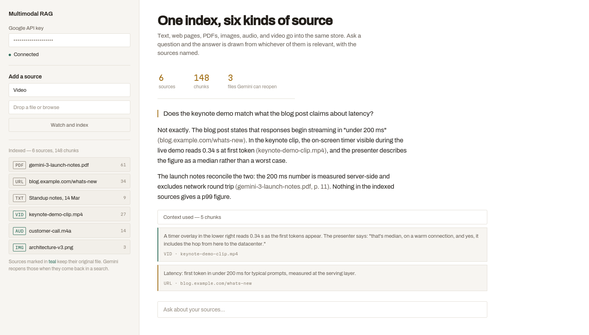

# RAG That Reads, Sees, and Hears

**One index for text, web pages, PDFs, images, audio, and video. When the answer lives in a video or a recording, the model reopens the file rather than reading a summary of it.**



The trick with multimodal retrieval is that you cannot embed a video. So this pipeline does two passes over media. At ingest, Gemini watches the video, listens to the audio, or looks at the image and writes a detailed description; that text is what gets chunked and embedded, and it's what similarity search runs against. Then at query time, if a chunk from a media source comes back in the top-k, the original file is attached to the generation request alongside the text.

That second half is the part worth having. The model does not answer from a description it wrote earlier, which is a lossy summary written before anyone asked a question. It reopens the file and looks again, with your actual question in hand. Ask what a timer in the corner of a video reads and it can tell you, even though no description would have thought to mention it.

## How it works

```
text ─┐
url ──┤─────────────────────────► chunk ──► embed ──► ChromaDB
pdf ──┘                                                  │
                                                         │
image ─┐   upload to Gemini      Gemini writes a         │
audio ─┤─► File API ──────────►  description  ──► chunk ─┤  (file URI kept
video ─┘        │                                        │   on every chunk)
                └──────────────── kept ──────────┐       │
                                                 │       ▼
                                                 │   question embedded
                                                 │       │
                                                 │       ▼
                                                 │   top 5 chunks
                                                 │       │
                                                 └───────┤ media files re-attached
                                                         ▼
                                                  Gemini 3 Flash
                                                         │
                                                         ▼
                                                answer with citations
```

## What it costs

Real numbers to expect before you point this at a folder of files:

- **Indexing a media file costs a generation call.** Describing a short video is not fast and not free. A ten-minute clip takes a while and burns real tokens before you have asked anything.
- **Embedding is one request per chunk.** The endpoint takes a single input at a time, so a 100-page PDF is several hundred calls. They run on a four-thread pool, which makes it tolerable, not quick. Raise `EMBED_WORKERS` if your quota allows.
- **Uploaded files do not live forever.** The Gemini File API holds them for about two days. After that the URI stored in chunk metadata is dead, and a query that retrieves that chunk will fail on the re-attach. For a demo app this never comes up; for anything long-lived, re-upload on a schedule or keep the file yourself. Check the current retention window in Google's docs before relying on it.
- **The index is in memory.** ChromaDB runs in-process with no persistence, so everything is lost when the Streamlit process restarts. That is deliberate for a demo and wrong for anything else — point `chromadb.PersistentClient` at a directory if you want it to survive.
- **Retrieval quality is capped by the description.** Search never touches the media, only the text written about it. If the description prompt does not mention what you end up asking about, the chunk will not be retrieved and the file will never get re-attached, however good the model is.

## Setup

You need Python 3.10+, [uv](https://docs.astral.sh/uv/), and a Google API key from [aistudio.google.com](https://aistudio.google.com).

```bash
git clone https://github.com/Sumanth077/Hands-On-AI-Engineering.git
cd Hands-On-AI-Engineering/multimodal/multimodal_rag
cp .env.example .env      # then add your key
uv sync
uv run streamlit run app.py
```

The app opens at `http://localhost:8501`. The key can also be pasted into the sidebar if you would rather not keep it in a file.

## Sources it accepts

| Type | Formats | What happens at ingest |
|---|---|---|
| Text | anything you paste | Split and embedded |
| URL | any public page | Fetched, script/nav/footer stripped, embedded |
| PDF | `.pdf` | Loaded page by page, first 100 pages only |
| Image | `.jpg` `.png` `.webp` `.gif` | Uploaded, described by Gemini, description embedded |
| Audio | `.mp3` `.wav` `.ogg` `.m4a` `.flac` | Uploaded, transcribed, transcript embedded |
| Video | `.mp4` `.mov` `.webm` `.avi` | Uploaded, described with timestamps, description embedded |

Image, audio, and video sources are marked in teal in the sidebar. Those are the ones whose files come back at query time.

## Knobs

All near the top of `rag.py`:

- `CHUNK_SIZE` / `CHUNK_OVERLAP` — 1000/150, sensible for prose, too coarse for tables
- `MAX_PDF_PAGES` — 100, raise it if you are willing to wait
- `EMBED_WORKERS` — 4 parallel embedding calls
- `UPLOAD_TIMEOUT` — 300s before giving up on File API processing
- `MEDIA_PROMPTS` — what Gemini is asked to notice in each media type. This is the highest-leverage thing in the file, because it decides what is findable later.
- `top_k` in `query()` — 5 chunks

## Files

```text
multimodal_rag/
├── rag.py           # GeminiEmbeddings, MultimodalRAG, ingestion and query
├── app.py           # Streamlit UI
├── pyproject.toml
├── uv.lock
├── .env.example
└── assets/demo.png
```

## Limits worth knowing

- One knowledge base per browser session, gone on restart.
- No deduplication. Index the same PDF twice and you get two copies competing in retrieval.
- No per-source deletion. "Start over" clears everything.
- Citations are whatever the model writes. Nothing verifies that a cited label actually contained the claim.
- LangChain is here for `RecursiveCharacterTextSplitter` and `PyPDFLoader`, nothing more. There is no agent and no chain.
